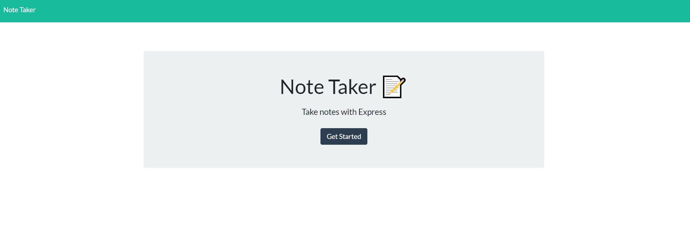
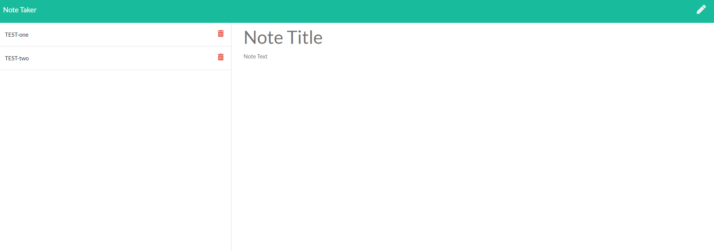

# Note Taker

## Project description
    This application can be used to write, save, and delete notes. Deployed on Heroku.

---

## Table of Contents
* [Installation](#installation)
* [Usage](#usage)
* [Contributing](#contributing)
* [Tests](#tests-information)

## How to use

    Once you finish input the 'Note title' and 'Note text' area, a save button will appear on the top right of the page.
    Click the button to save your note.
    On the left side of the page will show the notes you have saved.
    You can delete any note by clicking the delete button.

## Author information

    GitHub: https://github.com/GrandBearSleepy
    Email-address: Hengquan.Li@outlook.com